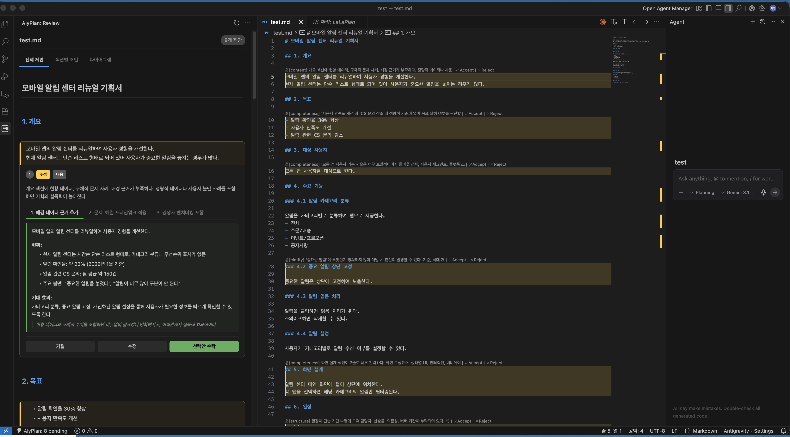
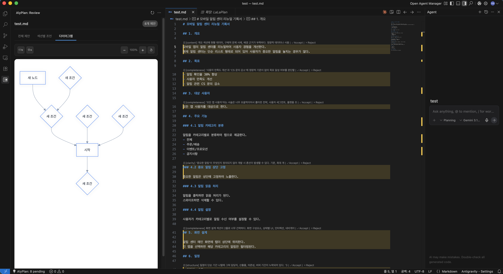

# LaLaPlan

AI 수정 제안을 시각적으로 리뷰하는 마크다운 기획서 도우미 VS Code 확장 프로그램입니다.




## 주요 기능

- **제안 리뷰 패널** — 사이드바에서 AI가 생성한 기획서 개선 제안을 카드 형태로 확인
- **인라인 하이라이트** — 제안이 있는 라인을 에디터에서 노란색으로 강조 표시
- **CodeLens 액션** — 에디터 라인 위에 `Accept | Reject` 버튼이 표시되어 바로 처리
- **탭 전환** — 전체 제안, 섹션별 조언, 다이어그램 탭으로 구분하여 리뷰
- **다이어그램 뷰** — 기획서의 플로우차트를 시각적으로 확인
- **일괄 처리** — 모든 제안을 한 번에 수락 또는 거절

## 설치

Extensions 패널에서 `LaLaPlan` 검색 후 설치

- **VS Code / Cursor** — VS Code Marketplace에서 설치
- **Windsurf / Antigravity** — Open VSX에서 설치

## 사용법

### 1. 기획서 열기
마크다운 기획서 파일(`.md`)을 에디터에서 엽니다.

### 2. AI 제안 생성
Claude Code에서 `/LaLaSuggest docs/파일명.md`를 실행하면 `.suggestions.json` 파일이 자동 생성됩니다.

### 3. 제안 리뷰
- 사이드바 **LaLaPlan** 패널이 자동으로 활성화됩니다
- **전체 제안** 탭에서 각 제안 카드를 확인합니다
- 각 제안에 대해 **거절**, **수정**, **선택안 수락** 버튼으로 처리합니다
- 에디터에서 하이라이트된 라인의 CodeLens(`Accept | Reject`)로도 처리할 수 있습니다

### 4. 다이어그램 확인
**다이어그램** 탭에서 기획서의 흐름도를 시각적으로 확인할 수 있습니다.

## 제안 파일 구조

```
프로젝트/
├── docs/
│   ├── example.md                    # 기획서 원본
│   └── .alyplan/
│       └── example/
│           └── example.suggestions.json  # AI 제안
```

## 설정

| 설정 | 기본값 | 설명 |
|------|--------|------|
| `alyplan.highlightColor` | `rgba(255, 213, 79, 0.15)` | 제안 라인 하이라이트 색상 |
| `alyplan.gutterIconColor` | `#FFD54F` | 거터 아이콘 색상 |

## 개발

```bash
npm install   # 의존성 설치
npm run build # 빌드
npm run watch # 개발 모드
```

## 라이선스

[MIT](LICENSE)
